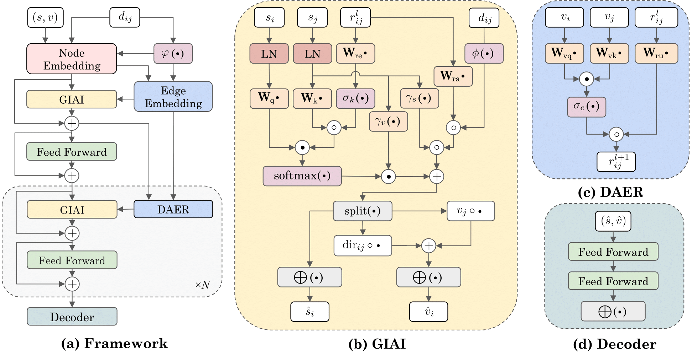

# Geometry-Infused 3D Graph Transformer (Ginformer)

This repository contains the code for the paper "Geometry-Infused 3D Graph Transformer," which is currently under review. The paper introduces Ginformer, a novel model that incorporates geometry-infused self-attention mechanisms to capture complex interatomic interactions and accurately predict molecular properties.

## Table of Contents

- [Overview](#overview)
- [Installation](#installation)
- [Results](#results)
## Overview

Ginformer is designed to effectively model 3D atomistic graphs by integrating geometric and spatial information into the attention mechanism. This repository includes the implementation of the model as described in the paper.

**Figure**: The overall architecture of Ginformer. The framework includes a node embedding layer, an edge embedding layer, and an interaction module comprising geometry-infused attention, feedforward networks, and an output head. Symbols: + denotes addition, ⋅ indicates dot product operations, ∘ represents element-wise (Hadamard) product, and LN signifies layer normalization.

## Installation

To install the required dependencies, please run:

`pip install -r requirements.txt`

## Results

The performance of Ginformer on the QM9 datasets is summarized below. For more results, please refer to the paper.

### QM9 Dataset

| Task                     | Alpha | Gap  | HOMO | LUMO | mu | Cv | G           | H           | R^2         | U           | U_0         | ZPVE          | std.          | log            |
| ------------------------ |-------|------|------|------|-----|----| ----------- | ----------- | ----------- | ----------- | ----------- | ------------- | ------------- | -------------- |
| Cormorant                | .085  | 61   | 34   | 38   | 38  | 26 | 20          | 21          | .961        | 21          | 22          | 2.03          | 2.14          | -4.75          |
| NMP                      | .092  | 69   | 43   | 38   | 30  | 40 | 19          | 17          | .180        | 20          | 20          | 1.50          | 1.78          | -5.08          |
| SchNet*       | .235  | 63   | 41   | 34   | 33  | 33 | 14          | 14          | .073        | 19          | 14          | 1.70          | 1.76          | -5.17          |
| ClofNet                  | .063  | 53   | 33   | 25   | 40  | 27 | 9           | 9           | .610        | 9           | 8           | 1.23          | 1.37          | -5.37          |
| LieConv                  | .084  | 49   | 30   | 25   | 32  | 38 | 22          | 24          | .800        | 19          | 19          | 2.28          | 1.35          | -4.99          |
| EGNN                     | .071  | 48   | 29   | 25   | 29  | 31 | 12          | 12          | .106        | 12          | 11          | 1.55          | 1.23          | -5.43          |
| SEGNN                    | .060  | 42   | 24   | 21   | 23  | 31 | 15          | 16          | .660        | 13          | 15          | 1.62          | 1.08          | -5.27          |
| PaiNN*        | .045  | 45.7 | 27.6 | 20.4 | 12  | 24 | 7.35        | 5.98        | .066        | 5.83        | 5.85        | 1.28          | 1.01          | -5.85          |
| DimeNet++*    | .044  | 32.6 | 24.6 | 19.5 | 29.7 | 23 | 7.56        | 6.53        | .331        | 6.28        | 6.32        | 1.21          | 0.98          | -5.67          |
| ComENet*      | .045  | 32.4 | 23.1 | 19.8 | 24.5 | 22 | 7.98        | 6.86        | .259        | 6.82        | 6.69        | 1.20          | 0.93          | -5.69          |
| SphereNet*    | .046  | 31.1 | 22.8 | 18.9 | 24.5 | 22 | 7.78        | 6.33        | .268        | 6.36        | 6.26        | 1.12          | 0.91          | -5.73          |
| LEFTNet                  | .048  | 40   | 24   | 18   | 12  | 23 | 7           | 6           | .109        | 7           | 6           | 1.33          | 0.91          | -5.82          |
| EQGAT                    | .053  | 32   | 20   | 16   | 11  | 24 | 23          | 24          | .382        | 25          | 25          | 2.00          | 0.86          | -5.28          |
| ET                       | .059  | 36.1 | 20.3 | 17.5 | 11  | 26 | 7.62        | 6.16        | .033        | 6.38        | 6.15        | 1.84          | 0.84          | -5.90          |
| HDGNN*        | .046  | 32   | 18   | 16   | 17  | 23 | 11          | 10          | .342        | 8.12        | 8.34        | 1.21          | 0.80          | -5.64          |
| Geoformer                | .040  | 33.8 | 18.4 | 15.4 | 10  | 22 | 6.13        | 4.39        | 0.28 | 4.41        | 4.43        | 1.28          | 0.75          | -6.12          |
| Equiformer               | .046  | 30   | 15.4 | 14.7 | 12  | 23 | 7.63        | 6.63        | .251        | 6.74        | 6.59        | 1.26          | 0.70          | -5.82          |
| Equiformer$_{\text{V2}}$ | .047  | 29.0 | 14.4 | 13.3 | 9.9 | 23 | 7.57        | 6.22        | .186        | 6.49        | 6.17        | 1.47          | 0.67          | -5.87          |
| Ginformer                | .033  | 22.5 | 16.3 | 14.1 | 8.2 | 20 | 5.81 | 4.08 | .028 | 4.23 | 4.05 | 1.10 | 0.61 | -6.24 |

